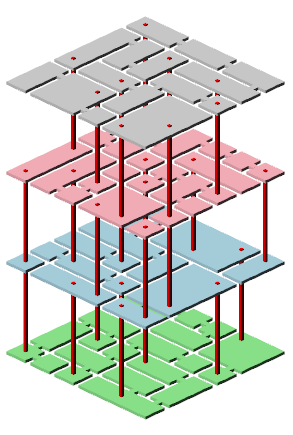

# DungeonGenDemo
A cell-based random maze generator in C#, visualized using WPF.

This sample generates a maze of specific width, length, and floor count, and uses a depth-first search algorithm to places nodes of varying size for each 'floor'.
